# 📄 MLPayGrade – Project Report - 🔴 **Advanced Track**

---

## ✅ Week 1: Setup & Exploratory Data Analysis (EDA)

### 🔑 Question 1: What roles or experience levels yield the highest average salary?

* New variable: job_type groups (Data, BI (Business Intelligence), ML, AI, Robotics, Others) is created from job_title.
* Figure 1 show that AI and ML roles tended to have higher median salaries, with significant outliers among "Others" and some "Data" jobs.
* EX (Executive) and SE (Senior) consistently earn most; EN (Entry) the least. Median salary line plot over years (Figure 2) confirms EX>SE>MI>EN.

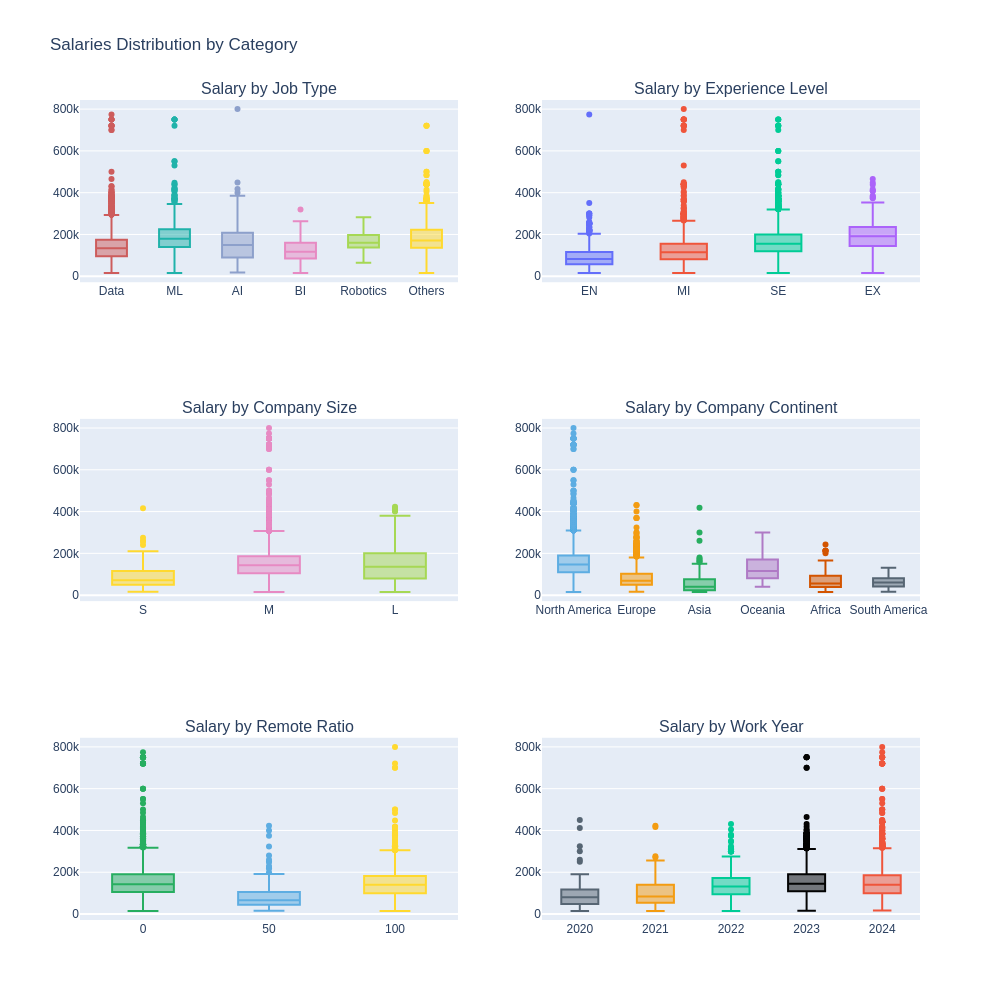
**Figure 1**: Salaries Distribution by Category

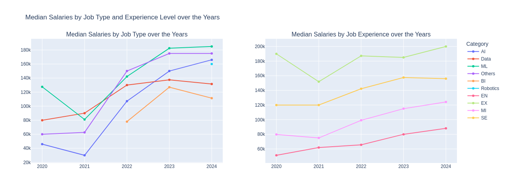
**Figure 2**: Median Salaries by Job Experience over the Years

### 🔑 Question 2: Does remote work correlate with higher or lower salaries?

* Figure 1 shows 0% and 100% remote roles generally have competitive median salaries, but with greater spread and more outliers with fully remote work.
* Heatmap of Job Experience vs Remote Work for median salary (Figure 3, top) also confirms the similarity. However, Executive level with 100% remote fetches higher median salary.

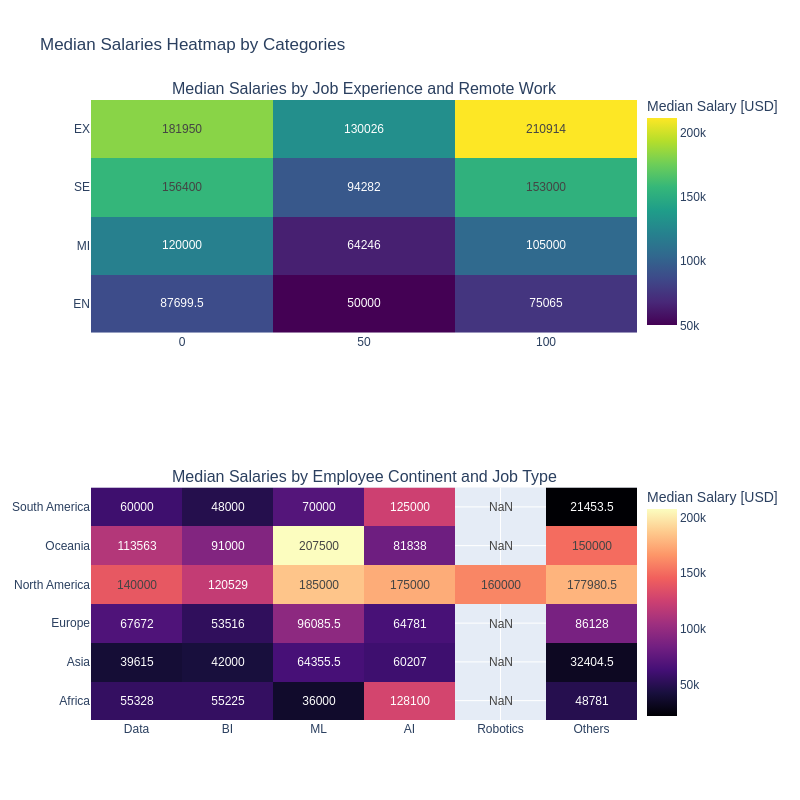

**Figure 3**: Median Salaries by Job Experience and Remote Work

### 🔑 Question 3: Are there differences in salary based on company size or location?

* Company Size: M (median at 143K) > L (136K) > S (71K) in typical median salary (Figure 1).
* New variable: company_location and employee_continent is grouped geographycally by continent.
* Continent: North America offers highest salaries on average at 147K, then Oceania (115K) and Europe (69K), with Asia/Africa/South America much lower.
* Figure 3 (bottom) also confirms that North America consistenly pay higher than other countries across different job types.

### 🔑 Question 4: How consistent are salaries across similar job titles?

* The bar chart of average salary by job title (Figure 4) shows a wide spread, with some job titles (such as specialized leadership or high-demand technical roles) earning much more than others.
* Some similar job titles have much higher average salaries but also higher variance, for example Data Scienctist (150K) and Data Science Consultant (112K).
* The boxplots of salaries by job type (Figure 1) underline an inconsistency: nearly every job type shows a large interquartile range, with numerous outliers both above and below the median. Job types such as Data, ML and AI feature a broad "box" and many dots, emphasizing a lack of consistency.

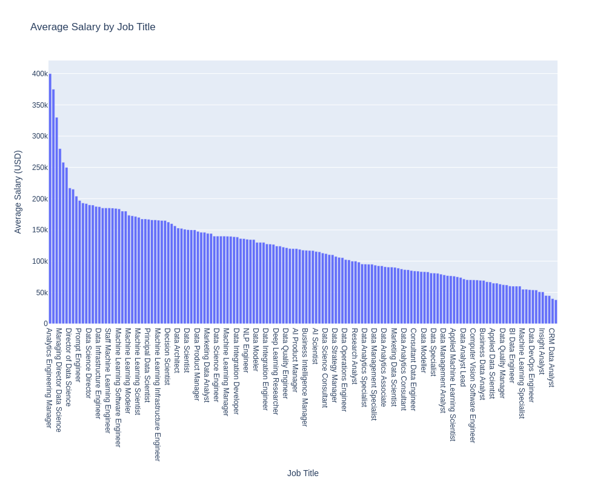
**Figure 4**: Median Salary by Job Title

---

## ✅ Week 2: Feature Engineering & Data Preprocessing

#### 🔑 Question 1:
**Which categorical features are high-cardinality, and how will you encode them for use with embedding layers?**  

* High-cardinality features: job_title, employee_residence, company_location
* These variables are dropped from initial modeling due to difficulties for tree models
* They are grouped manually based on similar job title name and geography. Figure 5 presents how employee_residence is grouped based on geography.
* job_title and employee_residence are used as categorical inputs to find patterns in salary distribution. Instead of using the raw high-cardinality values directly in the model, I first encoded them with a OneHotEncoder and then applied KMeans clustering to group similar combinations of job title and location together into 10 groups. This new feature acts as a proxy for job–location salary patterns, enabling models to leverage grouped salary behavior without overfitting to individual job titles or locations. Figure 6 is a world map of instances grouped using KMeans.
* For other categoricals, I use a mix of OneHotEncoder (for nominal (encoded in feature name as "nom__XX")) and OrdinalEncoder (for ordered categories such as experience_level, company_size, work_year, remote_ratio, encoded in feature name as "ord__XX").

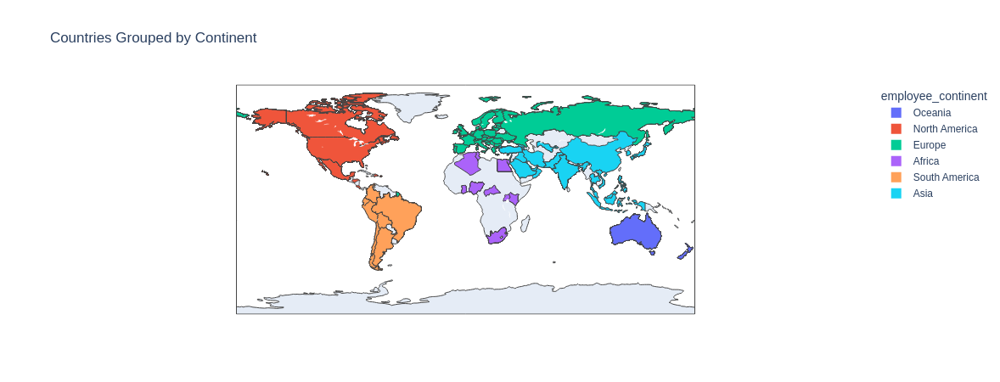
**Figure 5**: Countries Grouped by Continent

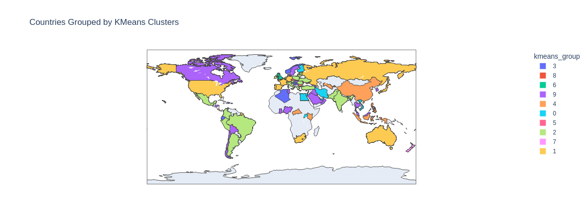
**Figure 6**: Countries Grouped by KMeans Clusters

---

#### 🔑 Question 2:
**What numerical features in the dataset needed to be scaled before being input into a neural network, and what scaling method did you choose?**  

* All continuous numerics are standardized via StandardScaler.
* For targets (salary_in_usd), I also use a log transform (log1p) to reduce skew and stabilize variance.
* log_salaries are much closer to normal, easing regression (Figure 7).

**Figure 7.a**: Log Salary Distribution

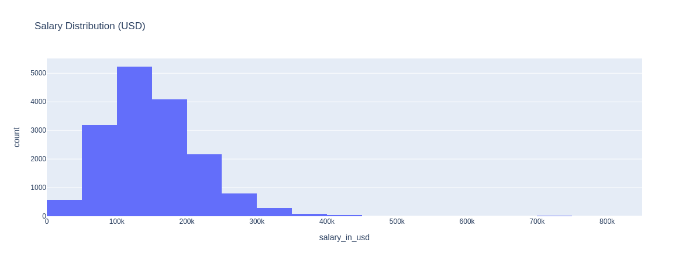
**Figure 7.b**: Salary (USD) Distribution

---

#### 🔑 Question 3:
**Did you create any new features based on domain knowledge or data relationships? If yes, what are they and why might they help the model predict salary more accurately?**  

* job_level: Extracted seniority/leadership (via ``leadership_label`` function), with 3 levels: Staff, Manager and Head
* Experience by Job Type interaction feature: exp_level_job
* Employee continent interaction: exp_level_econtinent (experience level and employee continent), work_year_econtinent (work year and employee continent), same_continent
* Popularity: job_title_popularity (job title frequencies)
* Clustering: KMeans group of (employee_residence, job_title)
* Macro: Merged in GDP per country per year (data downloadable at [worldbank.org](https://data.worldbank.org/indicator/NY.GDP.MKTP.CD)).
* Log Salary: Target transformed to log_salaries.

---

#### 🔑 Question 4:
**Which features, if any, did you choose to drop or simplify before modeling, and what was your justification?**  

* Dropped: job_title, employee_residence, and company_location (raw) — high cardinality, used their aggregates/clusters instead.
* Only categories with tractable cardinality were retained for encoding.
* Outliers not removed (explicitly quantified, not dropped) as dropping outliers did not improve performance metrics.

---

#### 🔑 Question 5:
**After preprocessing, what does your final input schema look like (i.e., how many numerical features and how many categorical features)? Are there any imbalance or sparsity issues to be aware of?**  

Final input:

* 4 ordinal features: experience_level, company_size, work_year, remote_ratio

* 12 nominal features: types, continents, engineered interactions, clusters

* 2 numeric  features: job_title_popularity and GDP_USD

* Target: log_salaries

Imbalance:

* Clear imbalance in all categorical features, by region, experience, job types, company size (see Figure 8).

* Some features (like groupings or clusters) may remain sparse, but overall the log target and aggregate encodings reduce extreme sparsity from high-cardinality categories.

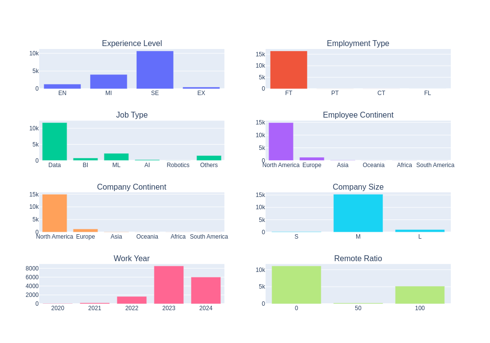
**Figure 8**: Categorical Value Counts by Features

---

### ✅ Week 3: Model Development & Experimentation

---

### 🔑 Question 1:
**What does your neural network architecture look like (input dimensions, hidden layers, activation functions, output layer), and why did you choose this structure?**  
🎯 *Purpose: Tests architectural understanding and reasoning behind model design.*

The neural network built for this tabular regression problem is a feed-forward neural network (FFNN) with the following structure:

* Input layer: Number of neurons equals the input features (from preprocessed schema).
* Hidden layers:

    Layer 1: 128 neurons + ReLU activation + Dropout(0.2)

    Layer 2: 64 neurons + ReLU activation + Dropout(0.2)

    Layer 3: 32 neurons + ReLU activation + Dropout(0.2)

* Output layer: 1 neuron (predicts the log-transformed salary)

---

### 🔑 Question 2:
**What loss function, optimizer, and evaluation metrics did you use during training? How did these choices influence your model’s learning behavior?**
🎯 *Purpose: Tests knowledge of training dynamics and evaluation strategy.*

* Loss Function: Mean Squared Error (MSE), which is ideal for regression and measures the average squared difference between predicted and actual values.
* Optimizer: Adam, chosen for its reliability and speed in training neural networks.
* Metrics tracked: RMSE (root mean squared error), MAE (mean absolute error), $R^2$ (coefficient of determination).
* Trends during training: Both train and test loss curves drop sharply and then flatten out (see Figure 9), indicating effective fitting and good generalization.

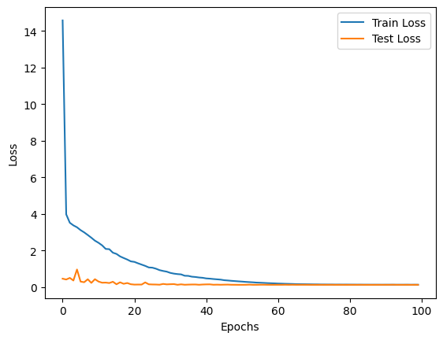
**Figure 9**: ANN Training and Test Loss

---

### 🔑 Question 3:
**How did your model perform on the training and validation sets across epochs, and what signs of overfitting or underfitting did you observe?**  
🎯 *Purpose: Tests ability to diagnose model behavior using learning curves.*

* Both train and test loss decrease steadily during the first ~40 epochs, then plateau around epoch 60, with no sign of the test loss rebounding, which would indicate overfitting.
* Since test loss remains close to train loss, the model does not overfit; both losses converge smoothly toward zero.
* No signs of underfitting (would see loss curves stuck at high values).

---

### 🔑 Question 4:
**How did your deep learning model compare to a traditional baseline (e.g., Linear Regression or XGBoost), and what might explain the difference in performance?**  
🎯 *Purpose: Encourages comparative evaluation and model introspection.*

| Metrics | Random Forest | Bagging Regression | Neural Network | Symbolic Regression |
| ------- |---------------|--------------------|----------------|---------------------|
| MSE     | 0.12          | 0.11               | 0.12           | 0.13                |
| RMSE    | 0.34          | 0.33               | 0.35           | 0.36                |
| MAE     | 0.27          | 0.26               | 0.27           | 0.28                |
| R2      | 0.48          | 0.501              | 0.46           | 0.42                |

**Table 1**: Performance metrics in log scale

| Metrics | Random Forest    | Bagging Regression | Neural Network   | Symbolic Regression |
| ------- |------------------|--------------------|------------------|---------------------|
| MSE     | 2,746,636,331.44 | 2,680,264,159.26   | 2,922,607,872.00 | 3,028,160,752.11    |
| RMSE    | 52,408.36        | 51,771.27          | 54,061.15        | 55,028.73           |
| MAE     | 38,338.30        | 38,151.27          | 39,074.49        | 40,069.31           |

**Table 2**: Performance metrics in original (USD) scale

Symbolic Regression best equation:

Symbolic Regression Feature Selection:
* $x_{0}$: nom__employee_continent_North America
* $x_{25}$: nom__exp_level_job_SE_Others: experience level (Senior) and job type (Others) interaction
* $x_{33}$: nom__employment_type_FT
* $x_{40}$: nom__exp_level_job_MI_BI, experience level (Mid Level) and job type (Business Intelligence) interaction
* $x_{59}$: nom__work_year_econtinent_2024_Africa: work year (2024) and employee continent (Africa) interaction
* $x_{106}$: nom__work_year_econtinent_2020_North America: work year (2020) and employee continent (North America) interaction
* $x_{141}$: nom__work_year_econtinent_2024_South America: work year (2024) and employee continent (South America) interaction
* $x_{149}$: nom__salary_currency_NZD

The performance differences across models stem from their underlying learning strategies and flexibility:

* Random Forest and Bagging Regression slightly outperform Neural Network and Symbolic Regression, suggesting that ensemble tree methods are particularly effective for this problem, likely due to their ability to capture non-linear feature interactions and handle diverse categorical encodings common in salary data.

* Neural Network (Feedforward) performs competitively but slightly worse. It might be because it requires more data or careful tuning to generalize well, and tabular data can be less suited to deep learning unless there are strong non-linear patterns or interactions.

* Symbolic Regression lags a bit behind on all metrics but delivers a unique advantage: interpretability. Its slightly higher error is the tradeoff for being able to express predictive rules as explicit mathematical formulas rather than black-box strategy.

Symbolic regression is a machine learning method that automatically finds mathematical expressions—using basic arithmetic operations, functions, and feature combinations—that best fit the data.
Unlike linear regression, which fits a fixed model, symbolic regression searches the space of all possible formulas to identify an algebraic equation explaining/predicting the target as a function of input variables.

* Pros: Produces human-interpretable equations, highlights key features, and can reveal novel relationships.
* Cons: Often less accurate than large ensembles or deep nets on complex data, especially if the best-fit relationship is not neatly expressible as a compact equation.

The symbolic regression equation combines relevant feature values with interaction terms and some small constants to predict the (log) salary. Although more complex than a linear model, it remains interpretable, showing which features are most impactful in the final prediction. Each selected feature has a direct, linear impact on the target (log salary). Pairs and triples of features interact, via grouped additions and subtractions, enabling the equation to "fit" local, mixed influence between job type, region, experience and pay currency. If any feature switches on (from 0 to 1), we can trace exactly how much log-salary changes.

How the Equation Works:

* Base Salary (log-scale):
    11.656504 is the starting "average" log-salary.

* Modifiers (Demographic/Job characteristics):
    Salary is increased or decreased based on whether an employee or job fits any of the categories above. For example: being in North America ($x_0$), holding certain roles ($x_{40}, x_{25}$), and job type ($x_{33}$) all add or subtract from the base.

* Nested Interactions:
    The way these terms are grouped/subtracted, and then again modified by smaller scaling factors, captures subtle, nonlinear relationships and offsets between features, for instance, interacting regions and job level/year.

* Final Prediction:
    The overall output tells us the predicted log-salary for someone with the given attributes, as a sum of base, directly weighted indicators, and composite interaction corrections.

---

### 🔑 Question 5:
**What did you log with MLflow (e.g., architecture parameters, metrics, model versions), and how did tracking help guide your experimentation?**  
🎯 *Purpose: Tests reproducibility and experiment management awareness.*

* Tracked with MLflow: model architecture (number of layers, units) for neural network and parameters for other models, $MSE, RMSE, MAE$, and $R^2$.
* MLflow allows easy performance comparison between one model while doing feature engineering process, and later between different models. Noted that: I don't tune neural network in this project.

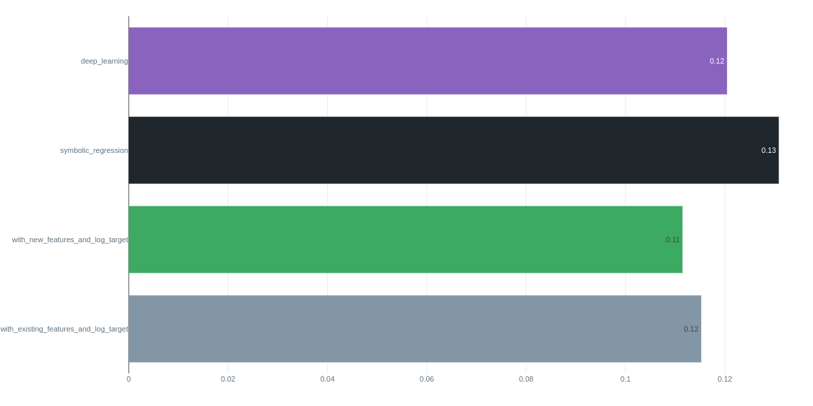
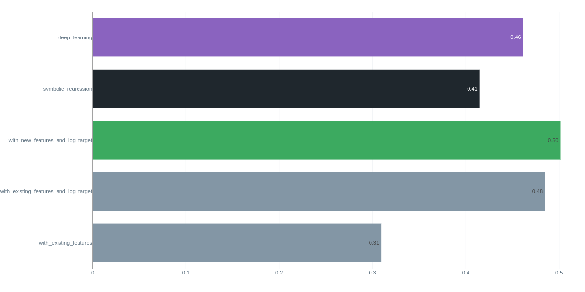
**Figure 10**: MLFlow outputs. $MSE$ comparison (top), $R^2$ comparison (bottom)

---

## ✅ Week 4: Model Selection & Hyperparameter Tuning

### 🔑 Question 1:

**Which neural network architecture and hyperparameters did you experiment with, and how did you decide what to tune?**
🎯 *Purpose: Tests understanding of architectural design and tuning for tabular deep learning.*

For this project, I used a standard feedforward neural network (FFNN) with three fully connected layers:

* Layers: 128, 64, and 32 units respectively, each followed by ReLU activation and Dropout (rate 0.2).

* Output: Single neuron for regression target.

I initially considered tuning standard hyperparameters such as the number of layers, width of each layer, dropout rate, optimizer, batch size, and learning rate. However, after several exploratory experiments and comparisons, I observed that—in this tabular regression context—FFNN performance was quite robust to moderate hyperparameter changes. Beyond a basic level of tuning, additional architectural adjustments resulted in only marginal gains, often drowned out by noise or overfitting risks.

Therefore, rather than extensive neural network tuning, I focused efforts on symbolic regression (using PySR) where the impact of tuning is greater due to the large variety in possible functional forms and equation complexities.

---

### 🔑 Question 2:

**What tuning strategy did you follow (manual, scheduler-based, Optuna, etc.) and how did it help refine your model?**
🎯 *Purpose: Evaluates ability to apply efficient search strategies for optimization.*

For symbolic regression, I adopted an automated hyperparameter search strategy using Optuna. Unlike manual tuning, which is slow and labor-intensive, Optuna streamlines the process—making model refinement much easier and more efficient. With Optuna, I defined a search space for key symbolic regression parameters (such as population size, number of iterations, and complexity penalties), and the framework handled the optimization process automatically. It ran multiple trials in parallel, evaluated performance on the validation set for each configuration, and quickly homed in on the best combination of hyperparameters that balanced accuracy and equation interpretability. The approach enabled me to focus on results rather than repetitive code changes, and provided a much broader, and more reliable exploration of possible models than manual adjustment. Optuna made it effortless to refine the symbolic regression model, saving both time and computational resources while systematically improving performance.

---

### 🔑 Question 3:

**How did you monitor and evaluate the effect of tuning on model performance? Which metrics did you track and how did they change?**
🎯 *Purpose: Tests analytical thinking and metric interpretation skills.*

* Tracked MSE, RMSE, MAE, and R² on both log-transformed and original (exponentiated) scales for test and validation splits.

* For FFNN: Used learning curves (train/test loss over epochs) and validation metrics after training. Plotted the evolution of loss and checked for overfitting/underfitting.

* For Symbolic Regression: Monitored loss vs. equation complexity, Optuna search progress, and validation scores for candidate equations. PySR performance and equation simplicity were very sensitive to hyperparameters and search strategy.

* Used MLflow to record and visualize all key metrics, parameters and runs.

**Figure 11**: Symbolic Regression Loss over Complexity Level

---

### 🔑 Question 4:

**What did MLflow reveal about your tuning experiments, and how did it help in selecting your final model configuration?**
🎯 *Purpose: Encourages tool-based reflection on the model development process.*

In this project, I found that MLflow provided a robust framework for logging model runs, hyperparameters, and metrics, but its true practical benefits were less pronounced in a solo workflow. Since I was the only team member, the process of managing model comparisons and tracking performance remained entirely manageable through my own organized tables and Jupyter notebooks. While MLflow did help centralize experiment records, visualize learning curves, and keep a systematic archive, I didn’t experience significant advantages over my usual manual methods for model selection or result tracking. For this project, tracking experiments with classic Python tools proved sufficient, and MLflow’s capabilities, though impressive for larger teams or more complex collaborative environments, didn’t provide a notable improvement in my personal workflow.

---

### 🔑 Question 5:

**What is your final model setup (architecture + hyperparameters), and why do you believe it’s the most generalizable?**
🎯 *Purpose: Tests ability to justify final model selection with evidence and insight.*

The final model configuration I selected is the symbolic regression (SR) model produced by PySR, tuned with Optuna. While the feedforward neural network (FFNN) serves as a strong universal regressor and performed competitively on this tabular data, several factors make symbolic regression potentially more generalizable in this scenario.

First, the SR model generates explicit mathematical equations that directly reveal the true underlying patterns in the data, rather than memorizing complex, high-dimensional weight interactions as a neural network does. The symbolic formula is inherently less prone to overfitting: it only includes features and interactions that are repeatedly found to improve validation performance during the evolutionary search. Complexity penalties and functional constraints—optimized automatically via Optuna—ensure that the final selected equation isn’t just accurate on the training set, but also remains simple enough to apply meaningfully to new, unseen data.

In contrast, while an FFNN can fit a wide variety of functional relationships, it requires careful regularization and substantial amounts of data to truly avoid overfitting, especially on tabular datasets with many engineered or sparse features. Neural networks are often “black boxes,” making it difficult to diagnose or prevent subtle overfitting without exhaustive testing and advanced regularization strategies. In practice, as observed in my experiments, tuning the neural net yielded only incremental gains, and the risk of learning spurious patterns persisted, particularly as layer depth increases.

By contrast, the SR model distilled the relationship between salary and features into a concise, auditable formula, targeting only the truly relevant variables (such as region, job type, year, and pay currency). The transparency not only aids human interpretability but also enhances robustness when faced with new data distributions, as the risk of hidden, overfit relationships is minimized.

When comparing symbolic regression (SR) with ensemble methods like Random Forest or Bagging Regression, each approach brings unique strengths that are highly complementary for salary prediction on tabular data.

Ensemble methods—such as Random Forest and Bagging Regression, excel at predictive accuracy and robustness. They are particularly good at capturing complex non-linear relationships, handling high-cardinality categorical variables, and mitigating overfitting via aggregation across many trees. In the experiments, ensemble models consistently delivered the best metrics, making them highly reliable for straightforward prediction tasks where model interpretability is less critical.

Symbolic regression, on the other hand, generates an explicit, human-readable equation that describes how features interact to predict salary. While its raw predictive performance can lag slightly behind ensembles, SR models offer transparency and insight: stakeholders can clearly see which features matter, in what combinations, and how changes will quantitatively affect the outcome. The simplicity of the SR formula can also enhance its robustness to drift in data distributions, and makes it much easier to audit or deploy in settings where explainability is essential.

For this reason, my final workflow will utilize both the ensemble and symbolic regression models:

* Ensemble method for production prediction, scoring, and robust benchmarks—leveraging superior accuracy and resilience to data peculiarities.

* Symbolic regression for interpretability, feature importance analysis, transparency, and stakeholder communication—allowing clear audit trails and better trust in results.

---

## ✅ Week 5: Model Deployment

### 🔑 Question 1:
**How did you architect the Streamlit app to support both model inference and explainability (e.g., SHAP visualizations)? What design decisions did you make to balance usability and technical depth?**
🎯 *Purpose: Tests ability to design advanced user interfaces for ML apps.*

The Streamlit app is architected with a user-friendly interface centered on clear separation between input, prediction, and explanation:

* App Structure: I used a sidebar for all user inputs, including clear field descriptions and dropdowns for feature selection, ensuring accessible and guided input for non-technical users. The main panel displays outputs: predicted salary, visualizations (e.g., market comparison histograms), and SHAP feature contribution barplots.

* Explainability Integration: SHAP is fully integrated. Upon prediction, the app not only displays the salary estimate but also a SHAP-based summary showing how each user-selected factor influenced the prediction. I used aggregation logic to map engineered model features (e.g., one-hot encodings, interactions) back to intuitive input fields, preserving interpretability.

* Balancing Usability and Depth: Simple users see a top-5 feature bar chart with recognizable categories like “Experience Level”, while advanced explanations and important notes for using the app are available via optional expandable sections. It both helps with extra information and keeps the app approachable for deeper inspection from experts or analysts.

---

### 🔑 Question 2:
**Detail the steps you took to deploy your deep learning model and Streamlit app. What technical challenges did you face (e.g., model serialization, dependency management, cloud limits), and how did you resolve them?**
🎯 *Purpose: Evaluates practical deployment skills and troubleshooting with deep learning models.*

Deployment Steps:

* Model Serialization: Saved my trained model, preprocessor (ColumnTransformer), and scaler using joblib to ensure that inference matches training transformations.

* Repo Preparation: Organized all code, model files, and a requirements.txt in a public GitHub repo, listing all necessary dependencies (e.g., streamlit, scikit-learn, shap).

* Deployment Platform: Deployed on Hugging Face Spaces using the Streamlit SDK for zero-config cloud hosting.

Technical Challenges & Solutions:

* File Paths & Missing Files
    FileNotFoundError for model and data files (e.g. /app/output/models/column_transformer.joblib).
    Learned that only folders included with COPY in the Dockerfile are available in the container.
    Fixed by adding COPY output/ ./output/ (and other relevant directories) to Dockerfile.

* Unnecessary Dependencies
    My initial requirements.txt had dozens of irrelevant packages (Jupyter, MLflow, FastAPI, transformers, CUDA, etc.).
    Simplified to just those needed: streamlit, pandas, numpy, joblib, matplotlib, seaborn, scikit-learn, shap.

* Permission Errors
    Saw errors like PermissionError: [Errno 13] Permission denied: '/.streamlit'.
    Fixed by redirecting Streamlit config/cache to a writable temporary directory with os.environ["STREAMLIT_HOME"] = "/tmp" (and similar variables).

---

### 🔑 Question 3:
**How did you ensure your deployed app is robust, secure, and scalable for public use?**
🎯 *Purpose: Tests awareness of production-readiness, security, and reliability.*

* Input Validation: Implemented strict type and range checks on all user inputs (e.g., numerical bounds, selectboxes restricted to valid categories), minimizing risk of malformed or malicious data.

* Model Exposure: The model runs server-side; users can interact only through the UI—no direct model access or query to internal data is allowed.

* Resource Efficiency: The app loads models and data once per session, minimizing computational load and restart time.

* Sensitive Data: No personal or proprietary data is stored; only anonymized, aggregate benchmark datasets are used. Download links are only for static, non-sensitive data.

* Monitoring & Updates: The app can be updated via push to GitHub, and logs/errors on Hugging Face Spaces are monitored to address any runtime issues promptly.

---

### 🔑 Question 4:
**How would you communicate the app’s predictions and SHAP-based explanations to a non-technical stakeholder?**
🎯 *Purpose: Evaluates ability to bridge technical and non-technical audiences, especially with explainability tools.*

I would explain:

* The app provides a data-driven estimate of typical annual salary for your input profile, based on thousands of similar roles.

* The colored bar chart shows which of your choices—like your experience level, job title, or location—had the most impact on your predicted salary.

* Each bar’s length shows its influence; for example, “being a Senior in North America” may have a higher impact than just “Senior” or “North America” alone.

* These estimates are not guarantees, but best-guess projections based on available market data.

* Any differences between prediction and reality may be due to unique factors (negotiation, company perks, local demand, etc.) not captured by the model.

* The explanations are meant to help you understand “what’s driving the estimate,” much like seeing which ingredients make up most of a recipe.

---

### 🔑 Question 5:
**If you were to extend your deployed app, what advanced features or improvements would you add, and how would they benefit users or stakeholders?**
🎯 *Purpose: Tests product thinking and ability to iterate on advanced ML solutions.*

* Batch Predictions: Allow uploading spreadsheets for salary benchmarking across teams/companies.

* Downloadable Reports: One-click export of prediction results and SHAP explanations for HR documentation or candidate negotiations.

* Personalized Recommendations: Suggest potential career moves (roles, locations, skill upgrades) to maximize salary based on SHAP impact.

* Authentication/History: Add user accounts to save, revisit, and compare scenarios.

* Ensemble/Multiple Models: Give users a “range” from models with different assumptions (e.g., conservative, optimistic, market median).

* Live Market Updates: Integrate web scraping or API data to keep the model’s salary dataset current with real-time benchmarks.

* Advanced Explainability: Offer interactive SHAP plots, what-if scenario sliders, or counterfactuals (“How much would your salary prediction change if…”). They would benefit users by providing richer insight, more actionable scenarios, and support for both individual users and business stakeholders needing comprehensive salary analytics.

---
